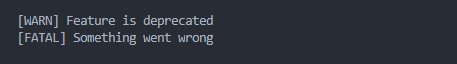

# Getting Started

## Installation

::: tip Note
You also need at least one reporter. See [Reporters](/reporters/) for available packages.
:::

With NPM:

```bash
npm install loglin
```

With Yarn:

```bash
yarn add loglin
```

## Creating your first logger

::: tip Note
This example uses the `@loglin/reporter-console`.
You can also use a different/custom one.
:::

```ts
import { createLogger } from 'loglin'
import { consoleReporter } from '@loglin/reporter-console'

const logger = createLogger({
  reporters: [consoleReporter()],
})

logger.warn('Feature is deprecated')
logger.fatal('Something went wrong')
```

Result in the console:



### Making the output fancy

You can use the `fancyFormatter` for creating colored log output in the console as follows:

```ts
import { createLogger } from 'loglin'
import { consoleReporter, fancyFormatter } from '@loglin/reporter-console'

const logger = createLogger({
  reporters: [
    consoleReporter({
      formatter: fancyFormatter(),
    }),
  ],
})

logger.error('Oh no!')
logger.success('I am looking good')
```

Result in the console:


